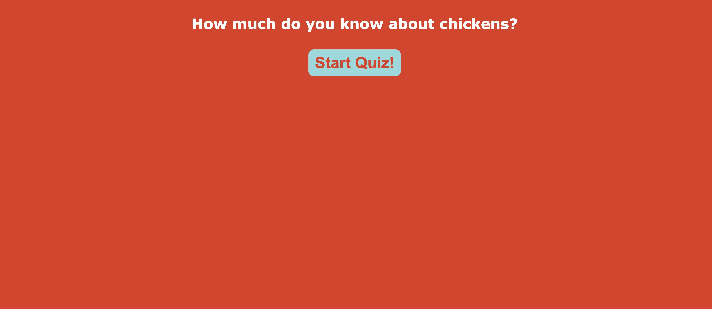
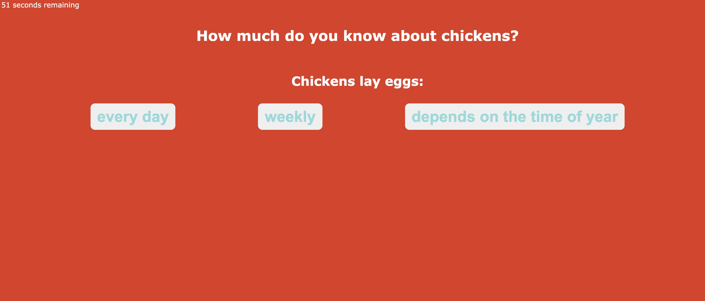
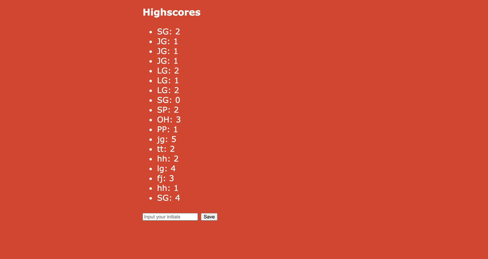

# Code-Quiz

Link to deployed website:
https://sabrielg.github.io/Challenge-4-Code-Quiz/

## Description
This project was created so that a user can take a 5 question short quiz about chickens! The quiz has a sixty second timer that stops the quiz when it reaches zero. If the user gets an answer incorrect 5 seconds is taken off of the timer. At the end of the quiz a list of scores is displayed they are prompted to input their initials. Their score is then displayed at the bottom of the list.

This project utilizes JavaScript and local Storage. I learned how to traverse the DOM, use for loops, event listeners, and use JSON to parse and stringify.

## Usage

When the user clicks the link they are taken to the main page of the quiz:
    
When the user clicks the 'Start Quiz' button a timer starts and they are presented with a series of questions.
    

When the user has answered all of the questions or the time has run out the quiz ends and they are taken to the highscores page and prompted to input their initials.
    

## Credits
T.A. Brian Ford, Tutor Armando Osario, classmates Scott Nichols and Makayla Howitz.
## License
MIT License

Copyright (c) 2021 Sabriel Gee

Permission is hereby granted, free of charge, to any person obtaining a copy of this software and associated documentation files (the "Software"), to deal in the Software without restriction, including without limitation the rights to use, copy, modify, merge, publish, distribute, sublicense, and/or sell copies of the Software, and to permit persons to whom the Software is furnished to do so, subject to the following conditions:

The above copyright notice and this permission notice shall be included in all copies or substantial portions of the Software.

THE SOFTWARE IS PROVIDED "AS IS", WITHOUT WARRANTY OF ANY KIND, EXPRESS OR IMPLIED, INCLUDING BUT NOT LIMITED TO THE WARRANTIES OF MERCHANTABILITY, FITNESS FOR A PARTICULAR PURPOSE AND NONINFRINGEMENT. IN NO EVENT SHALL THE AUTHORS OR COPYRIGHT HOLDERS BE LIABLE FOR ANY CLAIM, DAMAGES OR OTHER LIABILITY, WHETHER IN AN ACTION OF CONTRACT, TORT OR OTHERWISE, ARISING FROM, OUT OF OR IN CONNECTION WITH THE SOFTWARE OR THE USE OR OTHER DEALINGS IN THE SOFTWARE.
